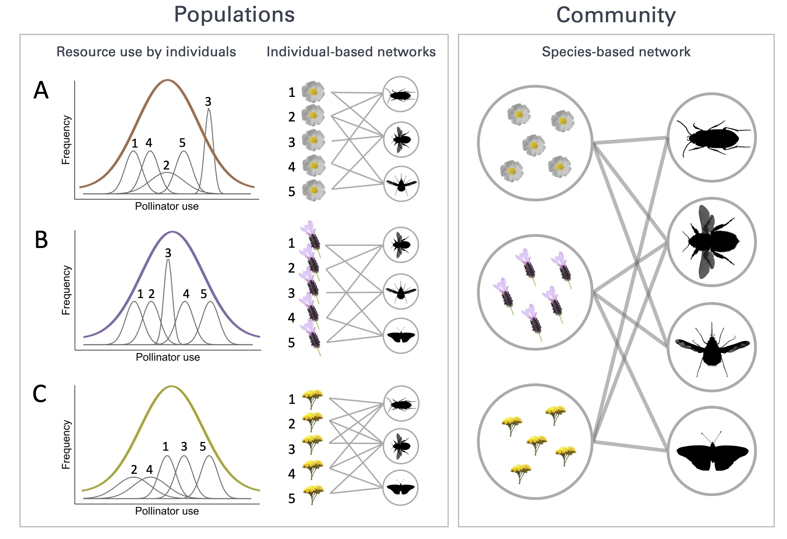

# Intraspecific variation in species interactions promotes the feasibility of mutualistic assemblages

## Abstract

Patterns of resource use observed at the species level emerge from the way individuals exploit the range of available resources. Hence, accounting for inter-individual differences in resource use, such as pollinator use by plants, is essential to advance our understanding of community assembly and persistence. By using finely-resolved data on plant-pollinator interactions recorded at the plant individual level, we evaluated how interactions by individuals scale up to affect community structure and dynamics. All co-occurring plant species comprised specialized individuals interacting with proper subsets of pollinator species that visited generalized individuals, and differences in interaction patterns were driven by among-individual phenotypic trait variation. Further, the nested structure and feasibility of plant-pollinator communities was maximized at higher levels of inter-individual plant variation. Our study sheds light on how pervasive properties of community structure arise from individual-level processes and contributes to elucidate the importance of preserving intraspecific variation in natural populations.

